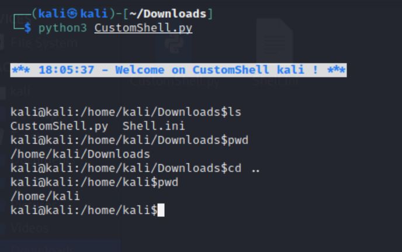

# CustomShell

## Description
This script implement a Custom Shell.

## Requirements
This package require :
 - python3
 - python3 Standard Library

## Installation
```bash
pip install CustomShell
```

## Launcher

 - Command line:
 ```bash
 CustomShell
 ```

 - Python:
 ```python
 import CustomShell
 CustomShell.shell()
 ```

 

## Configuration

### Default

 - Default configuration `~/Shell.ini` for **Linux**:
 ```ini
 [DISPLAY]
 prompt = {U}@{N}:{P}$
 start_intro = echo '{color}{bgwhite}{color}{bold}{blue}'
 end_intro = echo '{color}{reset}'
 intro = {n}*** {T} - Welcome on CustomShell {U} ! ***{n}
 start_quit = echo '{color}{bgwhite}{color}{underline}{red}'
 end_quit = echo '{color}{reset}'
 quit = {n}*** Bye {U} ! - {T} ***{n}

 [ALIAS]
 pyc  = python3 -c 
 pym  = python3 -m 


 ```
 - Default configuration `C:\\Users\\<username>\\Shell.ini` for **Windows**:
 ```ini
 [DISPLAY]
 prompt = {U}@{N}:{P}$
 start_intro = color a
 end_intro = ""
 intro = {n}*** {T} - Welcome on CustomShell {U} ! ***{n}
 start_quit = color 4
 end_quit = ""
 quit = {n}*** Bye {U} ! - {T} ***{n}

 [ALIAS]
 pyc  = python -c 
 pym  = python -m 


 ```

 You can add/change/remove alias.
 Example with this configuration: you can write write `pyc print('CustomShell')` to execute `python -c "print('CustomShell')"`.

### Variables for configuration

```
{U} = username,
{N} = hostname,
{P} = current path,
{T} = time,
{p} = system (Windows, Linux...)
{s} = os name (nt, posix...)
{n} = new line (\n)
```

### Unix Color

```
{black} {red} {green} {other} {blue} {purple} {cyan} {white} {bgblack} {bgred} {bggreen} {bgother} {bgblue} {bgpurple} {bgcyan} {bgwhite} {texte} {bold} {underline} {reset} {color}
```

 - To make a white background you can use: `{color}{bgwhite}`.
 - To make a blue bold text you can use: `{color}{bold}{blue}`.
 - To make a red undernline text you can use: `{color}{underline}{red}`.
 - To reset color: `{color}{reset}`.

## Links
[Github Page](https://github.com/mauricelambert/CustomShell)
[Documentation](https://mauricelambert.github.io/info/python/code/CustomShell.html)

## Licence
Licensed under the [GPL, version 3](https://www.gnu.org/licenses/).